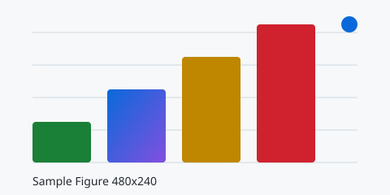
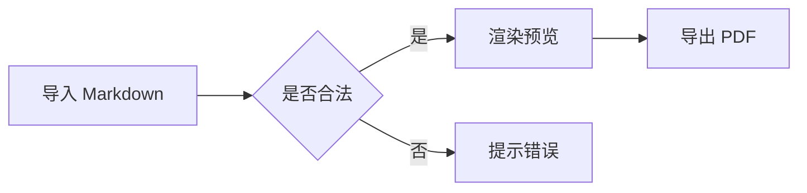
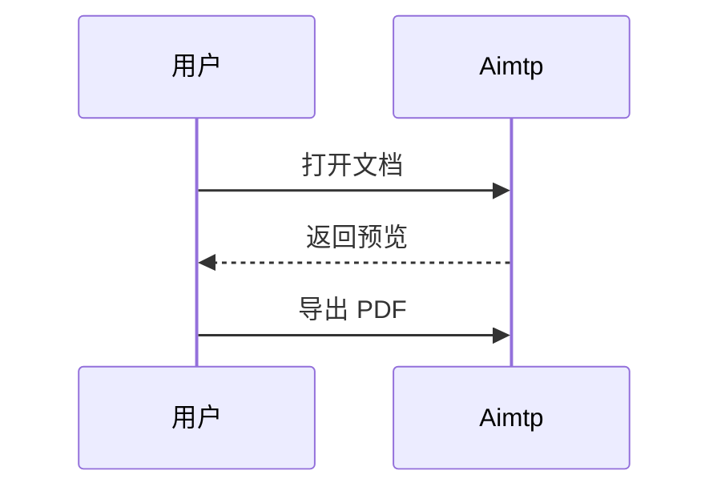
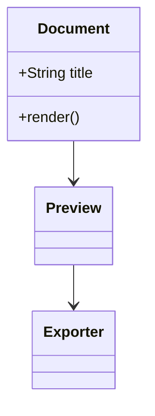

# H1 一级标题

这是位于 H1 之下的正文段落，用于观察标题与正文之间的间距、正文字号与行高是否符合设置面板中的配置。

## 01 标题层级

# H1 标题文本

## H2 标题文本

### H3 标题文本

#### H4 标题文本

##### H5 标题文本

###### H6 标题文本

标题层级验证结束，下面这段正文用于确认六级标题之后排版恢复正常。

## 02 段落与换行

这是第一段普通正文。段落之间靠空行分隔，用于验证「段落间距」设置是否生效。

这是第二段普通正文，它的上一行结尾处没有特殊符号，用于对照第一段的间距表现。

下面是硬换行验证：行尾保留两个空格
第二行应当另起一行，但不产生段落级别的额外间距。

下面是单回车换行验证：源文件中仅用一个回车分隔，
第二行同样应当渲染为新的一行，这是本项目开启 `breaks` 选项后的预期行为。

## 03 行内强调与扩展标记

基础强调：这是**加粗文本**，这是*斜体文本*，这是***粗斜体文本***。

删除线与代码：这是~~删除线文本~~，这是`行内代码`。

扩展标记：这是==高亮标记（mark）==，这是++下划线文本（ins）++。

上下标：水的化学式是 H~2~O，勾股定理写作 X^2^ + Y^2^ = Z^2^，上标与下标均须正确对齐基线。

转义字符：\*这不是斜体\*、\_这不是斜体\_、\#这不是标题\#。

## 04 链接与图片

普通链接：[Aimtp 仓库](https://github.com/XinDi-Technology/aimtp)。

带 title 的链接：[Aimtp 仓库](https://github.com/XinDi-Technology/aimtp "打开仓库页面")。

链接重生（linkify）：裸网址 https://github.com/XinDi-Technology/aimtp 与裸邮箱 contact@example.com 应自动识别为链接。

独立成段的图片（独占段落时不应被拆分到两个页面）：



带图注的图片：


行内图片混排：下方段落中出现内嵌图片  ，用于验证图片的基线对齐与行高是否正常。

> 若以单文件方式打开本文档，`./assets/sample.svg` 相对路径可能失效；请确认图片本身能否渲染，或换成任意本地图片路径重试。

## 05 列表

无序列表：

- 一级项目 A
- 一级项目 B
  - 二级项目 B-1
  - 二级项目 B-2
    - 三级项目 B-2-1
    - 三级项目 B-2-2
- 一级项目 C

有序列表：

1. 第一步
2. 第二步
3. 第三步

从 5 开始的有序列表：

5. 第五项
6. 第六项

列表项内含多段落与代码块：

- 列表项第一段文本
- 列表项第二段文本，其下方缩进排版了一段代码：

  ```javascript
  const listItemCode = true;
  ```

- 列表项第三段文本

长文本列表项换行：这是一个较长的列表项，内容长度足以超出一行宽度，用于验证列表项内部的悬挂缩进是否正确对齐首行文字而非项目符号。

待办事项（任务列表）：

- [x] 已完成的任务
- [ ] 未完成的任务
- [ ] 含`行内代码`的待办事项
- [ ] 含**加粗**与[链接](https://github.com/XinDi-Technology/aimtp)的待办事项

## 06 引用

单层引用：

> 这是一段引用文本。
> 这是引用的第二行内容。

嵌套引用：

> 第一层引用内容
> > 第二层引用内容
> > > 第三层引用内容

引用内嵌套其他元素：

> ## 引用内的 H2 标题
>
> 引用内的普通段落，用于验证引用块内部也有正确的段落间距。
>
> - 引用内的列表项一
> - 引用内的列表项二

## 07 分隔线

分隔线上方的段落。

---

分隔线下方的段落。

***

另一种写法（三个星号）产生的分隔线，应与上面的横线外观一致。

## 08 代码块与语法高亮

行内代码：`const answer = 42;` 应当与周围的中文正文基线协调。

JavaScript：

```javascript
function greet(name) {
  const message = "你好，" + name;
  console.log(message);
  return message;
}
```

TypeScript：

```typescript
interface Page {
  index: number;
  title: string;
}

export function renderPage(page: Page): HTMLElement {
  const el = document.createElement("section");
  el.dataset.index = String(page.index);
  return el;
}
```

Python：

```python
def fib(n: int) -> int:
    """计算第 n 项斐波那契数。"""
    a, b = 0, 1
    for _ in range(n):
        a, b = b, a + b
    return a
```

Bash：

```bash
# 安装依赖并打包
npm install
npm run build:win
```

JSON：

```json
{
  "name": "aimtp",
  "version": "0.1.0",
  "private": true,
  "engines": {
    "node": ">=24.0.0"
  }
}
```

HTML：

```html
<section class="page">
  <h1>预览页</h1>
  <p>用于验证 HTML 语言的着色。</p>
</section>
```

CSS：

```css
.page {
  padding: 12mm;
  line-height: 2;
}
```

Go：

```go
package main

import "fmt"

func main() {
    fmt.Println("aimtp")
}
```

SQL：

```sql
SELECT title, author, created_at
FROM documents
WHERE author = 'aimtp'
ORDER BY created_at DESC;
```

无语言的纯文本块：

```
这是一段未指定语言的代码块，
应当以等宽字体原样输出，不做着色。
```

未注册语言（用于验证回退行为，不做着色且原样转义）：

```aimtplang
token <tag> & "quote" 应该被正确转义显示
```

## 09 表格

基础表格 + 对齐方式（左 / 中 / 右）：

| 功能 | 语法 | 对齐 | 备注 |
| :--- | :---: | ---: | :--- |
| 加粗 | `**x**` | 左 | 表格内的**加粗**生效 |
| 高亮 | `==x==` | 中 | 表格内的==高亮==生效 |
| 上标 | `^x^` | 右 | 表格内的 X^2^ 生效 |
| 链接 | `[x]()` | 左 | 表格内可放[链接](https://github.com/XinDi-Technology/aimtp) |

宽表格（多列，用于验证是否会溢出页面或自动缩放）：

| 列一 | 列二 | 列三 | 列四 | 列五 | 列六 | 列七 | 列八 |
| --- | --- | --- | --- | --- | --- | --- | --- |
| A1 | B1 | C1 | D1 | E1 | F1 | G1 | H1 |
| A2 | B2 | C2 | D2 | E2 | F2 | G2 | H2 |
| A3 | B3 | C3 | D3 | E3 | F3 | G3 | H3 |

管道字符转义：表格单元格内出现竖线时使用 `\|` 转义，例如「表达式 \| 结果」应当正常显示为「表达式 | 结果」。

| 表达式 | 说明 |
| --- | --- |
| `a \| b` | 转义后的竖线 |
| `a && b` | 逻辑与 |

长文本单元格：

| 字段 | 描述 |
| --- | --- |
| title | 这是一个刻意写得比较长的单元格内容，用于观察表格内的文本换行是否正常、行高是否与正文协调且不会出现文字被裁切的情况。 |
| date | 短单元格 |

## 10 GitHub 风格警告框

> [!NOTE]
> NOTE：用于补充说明的一般性信息，标题与边框主色为蓝色。

> [!TIP]
> TIP：用于给出建议或技巧，主色为绿色。

> [!IMPORTANT]
> IMPORTANT：用于强调关键信息，主色为紫色。

> [!WARNING]
> WARNING：用于提示需要注意的内容，主色为黄色。

> [!CAUTION]
> CAUTION：用于提示危险操作，主色为红色。

多行且含结构的警告框：

> [!WARNING]
> 下面是警告框内部的多行内容：
>
> - 警告框内的列表项一
> - 警告框内的列表项二
>
> 下面是警告框内的第二段文本，用于验证内部段落间距。

## 11 脚注

Aimtp 支持标准脚注语法，这里是第一个引用点[^syntax]。同一句话也可以连续引用多个脚注[^multi][^second]。

[^syntax]: 这是第一条脚注的正文，脚注内部支持 **加粗** 与 `行内代码` 等行内语法。
[^multi]: 这是第二条脚注的正文，用于验证脚注编号是否与正文引用顺序一致。
[^second]: 这是第三条脚注的正文，用于验证多条脚注同时存在时的排序与排版。

> 请在设置面板中把「脚注位置」分别切到「文档底部」与「当前页底部」，各预览一次对比。

## 12 数学公式（需先在设置中开启 MathJax）

行内公式：欧拉恒等式 $e^{i\pi} + 1 = 0$ 应当就地渲染，不破坏行高。

独立公式：

$$
\int_{0}^{\infty} e^{-x^2} \, dx = \frac{\sqrt{\pi}}{2}
$$

矩阵：

$$
\begin{pmatrix} a & b \\ c & d \end{pmatrix}
$$

美元符号转义：商品价格为 \$199，而 $x$ 则是公式。当 MathJax 关闭时，$x$ 应当保留为原始的美元符号文本。

## 13 Mermaid 图表（需先在设置中开启 Mermaid）

流程图：



时序图：



类图：



## 14 封面（需先在设置中开启封面）

本文档顶部为 YAML front-matter，包含 `title`、`author`、`date`、`tags` 四个字段。开启封面后，首页应独立成页并展示标题、作者与日期；关闭封面时不应出现封面页。日期必须写成 2026-10-07 这样的 YYYY-MM-DD 格式，否则封面上的日期可能无法显示。

## 15 分页（需先开启 H1 / H2 自动分页）

本节用于验证 H1 与 H2 自动分页开关。关闭时，所有标题与其内容连续排布；开启后，除文档首个标题之外，每个 H1 与 H2 都应从新的页面开始，标题不会被留在前一页的底部形成孤立的孤标。

下面给出若干较长段落，用于把内容撑到多页，从而观察标题、段落、列表、表格、代码块在分页处的行为是否正常。

分页观察段落一：文字应当连续排布到页面边距为止再换到下一页，所有页面的可用区域都由页边距设置决定，页边距变大时每页容纳的行数应随之减少，这是判断分页是否按实际纸张尺寸计算的最直接依据。

分页观察段落二：这一段继续提供足量文字以便跨页。请重点查看页面底部与页眉页脚之间的距离是否符合页眉页脚设置中的内容，页码是否连续且与页面顺序一致，页脚格式在「页码」与「第 X 页 / 共 X 页」之间切换时是否随之改变。

分页观察段落三：这一段用于补足篇幅，使文档至少达到三页以上，从而验证多页场景下的页码连续性与页眉内容一致性。

分页观察段落四：最后一段占位文本，用于确保本节内容足够长，能够在开启 H2 分页后跨页展示。

## 16 排版细节（typographer）

英文双引号 "Aimtp" 应渲染为排版引号而非直引号；两连字符 A -- B 应渲染为短破折号；三个连续的点 ... 应渲染为省略号。

中英混排：Aimtp（Markdown to PDF）是一款中文排版工具，中英文之间、数字与 100 个单位之间应当保持自然的间距与断行，长英文单词 hyphenation-example-of-a-long-token 在行尾的处理方式请一并观察。

## 17 由设置面板控制、非 Markdown 语法的检查项

以下项目不由文档内容决定，请在对照表中逐项确认：页面尺寸（A4 / A3）、页面方向（纵向 / 横向）、页边距上下左右、DPI、正文字体、代码字体（JetBrains Mono / Monaspace Argon Frozen）、基础字号、行高、段落间距、代码高亮主题（GitHub / Monokai / Dracula）、代码行号开关、页眉内容与对齐、页脚内容与对齐、封面开关。
