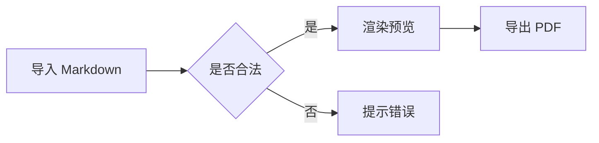
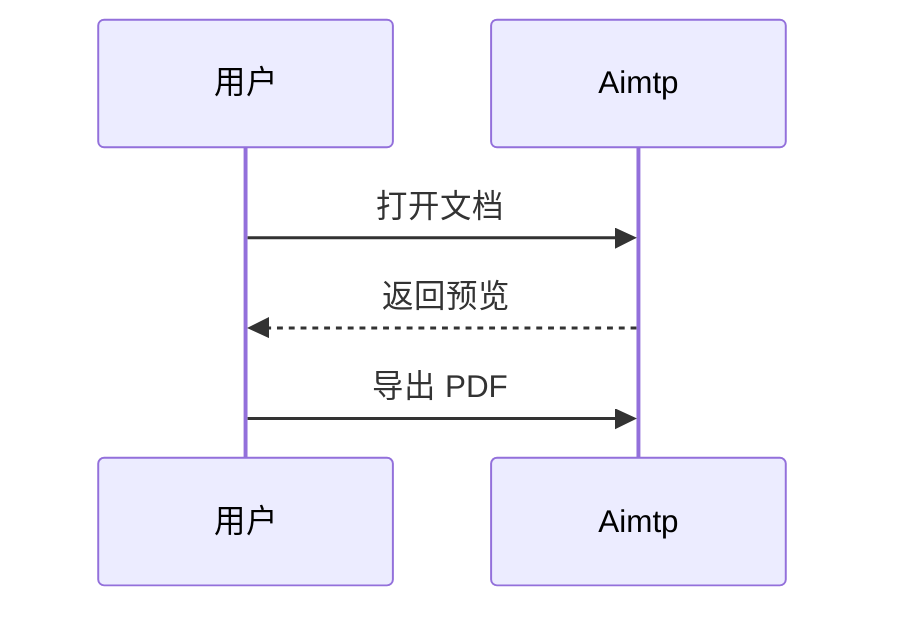
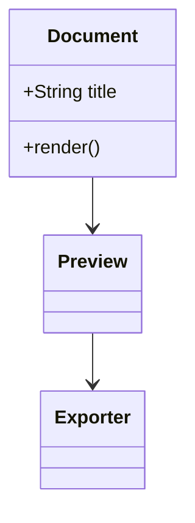
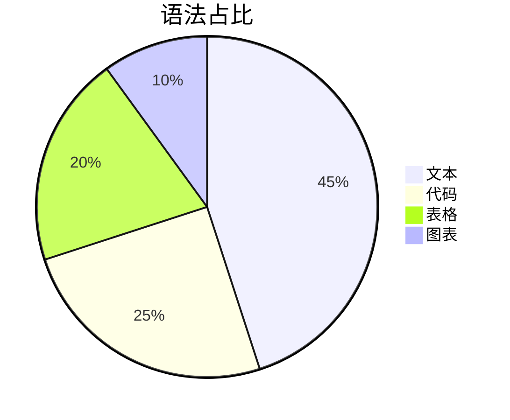

# 08 数学公式与 Mermaid 图表

> 用途：验证 MathJax 与 Mermaid 两个扩展。
> 对应设置：这两个扩展默认关闭，须先在设置面板中开启后再预览；开启与关闭两种状态都要各测一次，观察「关闭时」是否优雅降级。

## 数学公式

行内公式：欧拉恒等式 $e^{i\pi} + 1 = 0$ 应当就地渲染，且不破坏当前行高。

独立公式：

$$
\int_{0}^{\infty} e^{-x^2} \, dx = \frac{\sqrt{\pi}}{2}
$$

矩阵：

$$
\begin{pmatrix} a & b \\ c & d \end{pmatrix}
$$

希腊字母与求和：

$$
\alpha + \beta = \sum_{i=1}^{n} x_i
$$

分式与根号：

$$
\frac{-b \pm \sqrt{b^2 - 4ac}}{2a}
$$

美元符号转义：商品价格为 \$199，而 $x$ 则是公式。当 MathJax 关闭时，$x$ 应当保留为原始的美元符号文本，不应报错。

## Mermaid 图表

流程图：



时序图：



类图：



状态图：


饼图：



非法语法（验证错误处理，应给出提示而不是崩溃）：

```mermaid
flowchart LR
  A -->>]]] 这是故意写错的语法
```

## 渲染失败时的检查点

关闭扩展后再看一遍本文件：公式应保留原始的美元符号原文，图表代码块应保留原样文本，两者都不应导致预览空白或报错中断。

