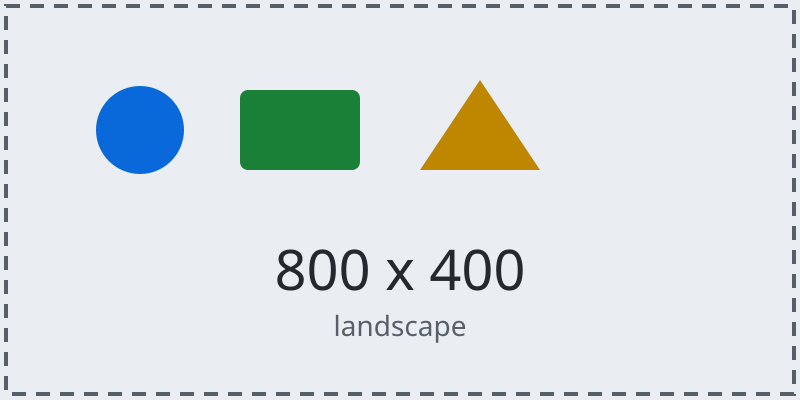
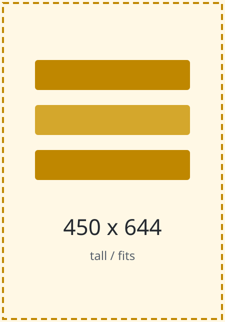
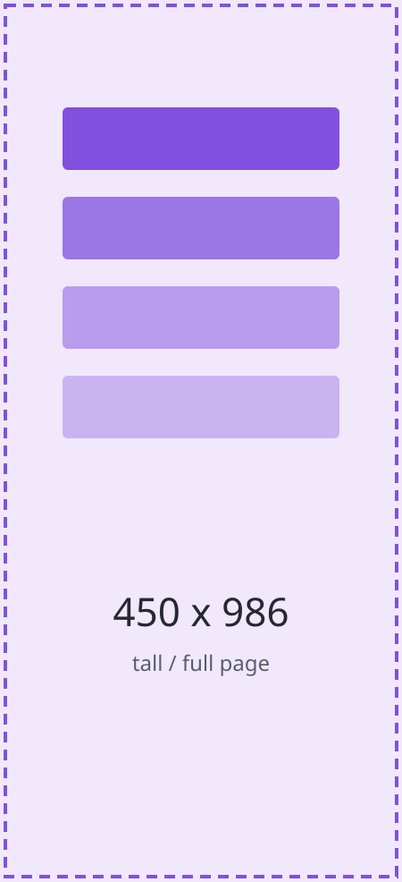
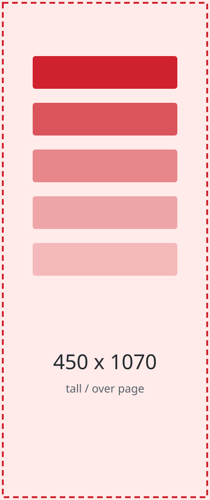
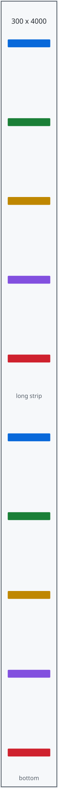
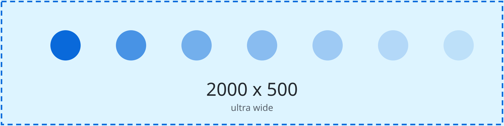
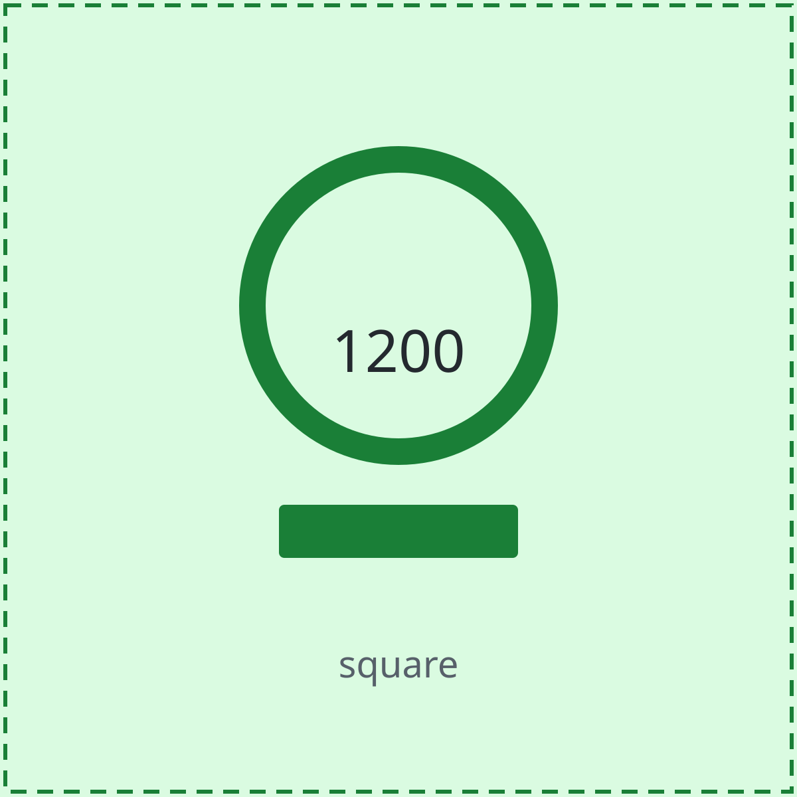

# 11 图片

> 用途：验证各类图片形态（比例、尺寸、极端长宽）在各种摆放位置下的显示与分页表现。
> 素材位于同级 `assets/` 目录，文件名即尺寸，便于肉眼核对是否变形或被裁切。
> 本文件请先按默认设置完整过一遍，再按文末「换设置重测」一节换几组页面设置各跑一遍。

## 1. 基本形态

### 1.1 独占段落的图片



图片之后紧跟的一段正文。这一段用于验证图片与后续段落之间的间距是否正常，以及图片是否会与正文重叠。

### 1.2 带图注的图片


带图注的图片之后的一段正文，用于同上验证。

### 1.3 行内图片

这是段落中嵌入的行内小图  ，用于验证图片的基线对齐是否合理、是否过度撑高所在行。这一行文字写得长一些，确保行内图片周围有足够的上下文可以观察行距变化。

### 1.4 一张图后面跟多行正文


第一段：图片之后的正文。

第二段：继续的正文内容。

第三段：再多写一段，确保图片后面跟有足够的后续内容，用于观察排版是否连续。

## 2. 不同尺寸与比例

### 2.1 竖图（比例适中）



这张图高度适中，应当与正文同页排布，不需要独占一页。

### 2.2 较高的竖图



这张图高度接近一页内容区高度，请观察它是如何排布的：是否占满内容区、是否被压缩、是否与下方正文产生重叠。

### 2.3 超过一页的竖图



这张图高度超过内容区高度，应当在内容区内等比适配，不裁切、不变形、不出血，也不会被拆成多张或消失。

### 2.4 极端长图



这张图高度远大于宽度，应当在内容区内等比缩小到最大可见尺寸，同时保持长宽比不变。

### 2.5 超宽图



这张图宽度远大于高度，应当限制在内容区宽度之内，不产生横向溢出，高度按比例收缩。

### 2.6 大正方形图



这张图宽高相等且尺寸较大，请在内容区内等比适配。

### 2.7 小图


这张图尺寸很小，应当按原始尺寸显示而不是被放大。

## 3. 连续排列的图片

### 3.1 两张紧邻


两张图片之间没有任何文字，这是连续图片的第一种形态。

### 3.2 三张紧邻


三张图片连续排列，请逐张确认都可见。

### 3.3 五张紧邻


五张小图连续排列，请确认数量为五。

### 3.4 图片之间夹文字（对照组）


中间一行文字。


中间又一行文字。


这组图片之间都有文字间隔，用作与上面紧邻情况的对照。

### 3.5 连续的高图


两张超过一页高度的图片连续排列，两张都必须可见。

## 4. 图片与周围内容的关系

### 4.1 图片后紧跟较长的正文


图片之后紧跟一段较长的正文。这一段故意写得比较长，用于确保后续内容足以占满剩余空间并继续排布：请把这段文字读完，确认图片没有被后续内容覆盖，也没有出现图片消失或位置错乱的情况。继续提供一些文字以便让内容接近页面底部，从而触发溢出相关的处理逻辑。

再补一段：如果上面那张图正好落在页面底部附近，它应当整体换到下一页，而不是被裁切或丢失，也不会在当前页只露出一部分。

### 4.2 图片位于引用之后

> 这是一段引用。


引用之后的图片应当正常显示。

### 4.3 图片位于列表之后

- 列表项一
- 列表项二
- 列表项三


列表之后的图片应当正常显示。

### 4.4 图片位于代码块之后

```javascript
const ratio = width / height;
```


代码块之后的图片应当正常显示。

### 4.5 图片位于标题之后

标题之后紧跟图片是符合直觉的常见写法。


## 5. 表格中的图片

### 5.1 每格一张图片

| 图片一 | 图片二 |
| --- | --- |
|  |  |
|  |  |

这个表格的每个单元格里都只有一张图片。请确认表格保持两列、两列宽度正常、图片没有被异常压缩。

### 5.2 带表头的图片表格

| 名称 | 预览 |
| --- | --- |
| 横向图 |  |
| 正方形图 |  |
| 宽图 |  |

这个表格有表头，且只有第二列包含图片。请确认列宽正常、表头与数据列对齐。

### 5.3 单元格内图文混排

| 名称 | 内容 |
| --- | --- |
| 图文单元格 |  这是图片后面的说明文字 |
| 纯文字单元格 | 这个单元格只有文字，用于对照宽度 |

### 5.4 单元格内图片换行的情况

| 第一列 | 第二列 |
| --- | --- |
|  | 这一格是一张图片，左边一格是一张图片，两边都只有图片。左侧单元格里图片的上方不应多出空白行。 |
| 这一格是纯文字内容，用于观察同一列在不同内容类型下的宽度是否一致。 |  |

### 5.5 图片表格前后的普通内容

表格之前的正文段落。

| 左列图 | 右列图 |
| --- | --- |
|  |  |

表格之后的正文段落，用于验证表格整体与上下文的间距。

## 6. 图片与其他块的组合

### 6.1 引用内的图片

> 引用文字在前。
>
> 
>
> 引用文字在后。

### 6.2 列表项内的图片

- 列表项内的图片：
  
- 另一个列表项

### 6.3 图片与代码、表格、引用连续出现


| 列一 | 列二 |
| --- | --- |
| A | B |

> 引用。

```bash
echo "after image"
```

## 7. 分页位置相关

下面提供若干填充段落，目的是把内容推到接近页面底部的位置，以便观察紧接着的图片在跨页时的表现。

填充段落一：这一段用于增加文档长度，使后续内容接近第一页的底部。文字本身没有实际含义，仅作为排版高度的填充物使用，请一直往后阅读以抵达本节末尾的图片部分。

填充段落二：继续补充文字以确保有足够的篇幅。此时如果页面已经接近底部，那么紧随其后的图片应当整体排到下一页，而不是在当前页露出一部分、在下一页再露出一部分。

填充段落三：这一段把内容推到更接近页边的位置，使下面第一张图的起点几乎贴着页面底边，这是一个自然的边界情况，用于检查是否正常处理。

以下是紧贴上述填充内容的图片：


上面这张图接近一页高度，如果上一页已经放不下它，应当整体排到下一页。

填充段落四：在图之后继续补充文字，用于观察图片之后是否还有足够的内容触发后续排版。

填充段落五：再补一段文字，确保文档长度足以让内容继续往后流动。

以下是第二张位于边界的图片：


这张图之后还有一些文字用于收尾本小节。

## 8. 异常与兜底

### 8.1 路径失效的图片


上面这张图指向一个不存在的路径，请确认它不会导致预览空白或崩溃。

### 8.2 无替代文字的图片


## 9. 换设置重测

本文件中的以下内容建议在不同页面设置下各重看一次：第 2.2 / 2.3 / 2.4 节（接近或超过一页高度的图片）、第 3.5 节（连续高图）、第 5 节（表格中的图片）、第 7 节（分页位置）。建议尝试的组合：

- A4 纵向，页边距 20mm（默认）
- A4 纵向，页边距 40mm
- A3 纵向
- A4 横向
- 段落间距调到较大值
- 基础字号调到较大值

## 10. 尾部内容

下面一段用于把本节推到最后，以便检查文档末尾的图片。

这是倒数第二段文字，它的作用是把排版推近文档的末尾位置。


